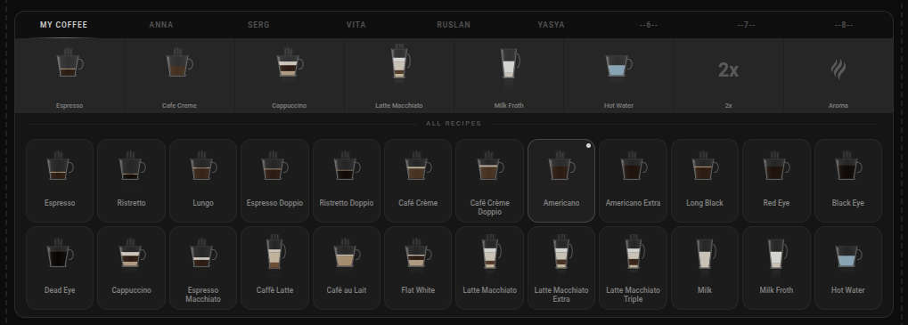
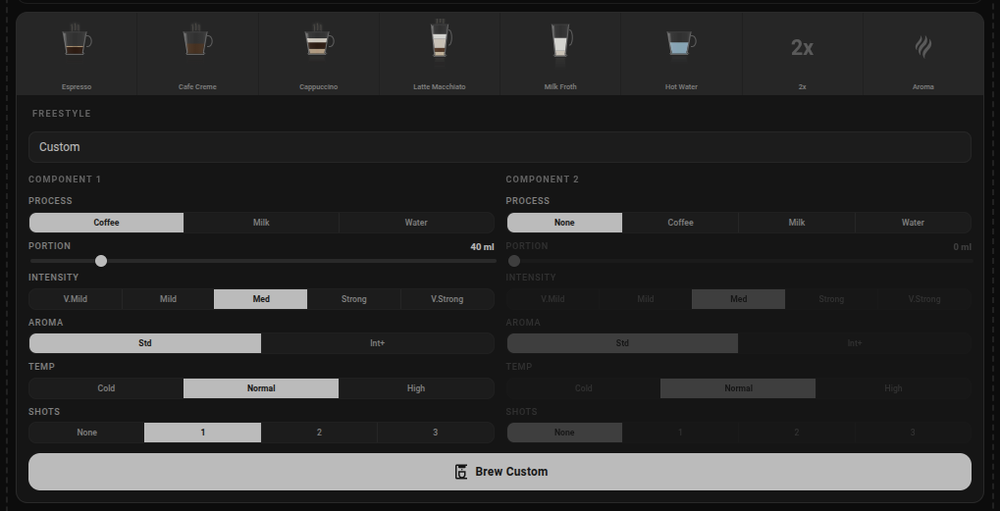
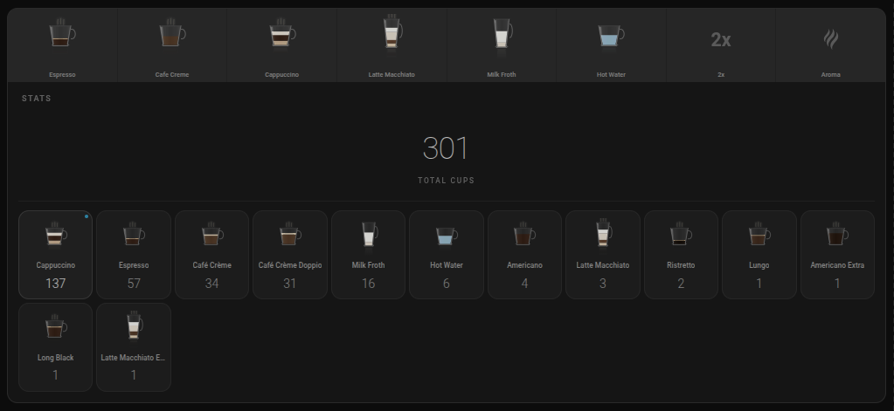
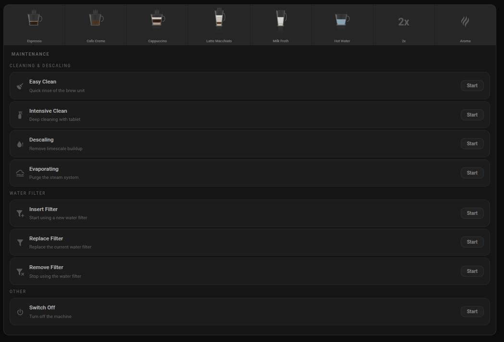
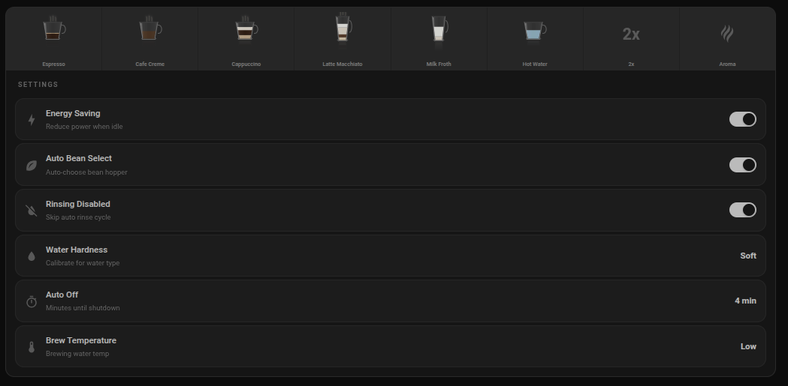

# Melitta Barista Card

[](https://my.home-assistant.io/redirect/hacs_repository/?owner=dzerik&repository=melitta-barista-card&category=plugin)

[](https://github.com/dzerik/melitta-barista-card/releases)
[](https://github.com/dzerik/melitta-barista-card/releases)
[](https://github.com/dzerik/melitta-barista-card/actions/workflows/tests.yml)
[](https://github.com/dzerik/melitta-barista-card/actions/workflows/validate.yml)
[](LICENSE)
[](https://hacs.xyz)
[](https://www.home-assistant.io/)
[](#localization)
[](https://lit.dev/)

A custom Lovelace card for the [Melitta Barista Smart](https://github.com/dzerik/melitta-barista-ha) Home Assistant integration. Built with [Lit](https://lit.dev/) and TypeScript.

## Features

- **Auto-detection** -- automatically finds your Melitta device, no manual configuration needed
- **Recipe grid** -- all 24 recipes with SVG cup icons, DirectKey quick-access buttons, and user profile tabs
- **Freestyle builder** -- custom drink with two components, intensity, aroma, temperature, shots, and portion size
- **AI Sommelier** -- bean hopper overview, favorite recipes with one-tap brew, and a "Surprise me" recipe generator (requires the integration's Sommelier feature)
- **Cup statistics** -- total counter and per-recipe stats dashboard
- **Maintenance** -- easy clean, intensive clean, descaling, evaporating, water filter management
- **Machine settings** -- toggles and sliders for energy saving, auto bean select, rinsing, water hardness, auto-off, brew temperature
- **Real-time status** -- machine state badge, BLE connection indicator, brewing/cleaning progress bar
- **Action alerts** -- fill water, empty trays, insert brew unit, and other required actions
- **29 languages** -- follows your Home Assistant profile language, switches on the fly
- **Visual editor** -- device dropdown in the card editor UI
- **Theme-aware** -- light and dark mode styling

## Screenshots

### Recipes

Recipe grid with user profiles, DirectKey quick-access buttons, and all available recipes with SVG cup icons.



### Freestyle

Custom drink builder with two components, adjustable intensity, aroma, temperature, shots, and portion size.



### Stats

Cup counter dashboard with total count and per-recipe statistics.



### Maintenance

Cleaning, descaling, evaporating, water filter management, and power off.



### Settings

Machine configuration: toggles (energy saving, auto bean, rinsing) and sliders (water hardness, auto-off, brew temperature).



## Installation

### Via HACS (recommended)

1. Open HACS in your Home Assistant instance.
2. Go to **Frontend** and select the three-dot menu in the top right corner.
3. Choose **Custom repositories**.
4. Add the repository URL: `https://github.com/dzerik/melitta-barista-card`
5. Select category **Dashboard** and click **Add**.
6. Search for "Melitta Barista Card" in HACS and install it.
7. Refresh your browser (hard reload: Ctrl+Shift+R).

### Manual Installation

1. Download `melitta-barista-card.js` from the [latest release](https://github.com/dzerik/melitta-barista-card/releases).
2. Copy it to your `config/www/` directory.
3. In Home Assistant, go to **Settings** > **Dashboards** > three-dot menu > **Resources**.
4. Add resource: `/local/melitta-barista-card.js` (type: JavaScript Module).
5. Refresh your browser.

## Configuration

The card **automatically detects** your Melitta Barista device -- just add the card and it works:

```yaml
type: custom:melitta-barista-card
```

All options are optional:

```yaml
type: custom:melitta-barista-card
name: My Coffee Machine
show_recipes: true
show_freestyle: true
show_sommelier: true
show_stats: true
show_maintenance: true
show_settings: false
compact: false
```

### Options

| Option             | Type    | Default       | Description                                    |
| ------------------ | ------- | ------------- | ---------------------------------------------- |
| `name`             | string  | auto-detected | Card title (auto-filled from device name)      |
| `entity_prefix`    | string  | auto-detected | Entity prefix (auto-detected from integration) |
| `show_header`      | boolean | true          | Show card header with connection indicator     |
| `show_status`      | boolean | true          | Show machine state badge and action alerts     |
| `show_profiles`    | boolean | true          | Show user profile tabs (when >1 profile)       |
| `show_recipes`     | boolean | true          | Show recipe selector when machine is ready     |
| `show_freestyle`   | boolean | false         | Show freestyle drink builder                   |
| `show_sommelier`   | boolean | false         | Show AI Sommelier section                      |
| `show_stats`       | boolean | false         | Show cup statistics section                    |
| `show_maintenance` | boolean | false         | Show maintenance section                       |
| `show_settings`    | boolean | false         | Show machine settings section                  |
| `compact`          | boolean | false         | Compact layout                                 |

If you have multiple Melitta machines, use the visual editor dropdown to select the desired device, or set `entity_prefix` manually.

## Localization

The card ships with **29 languages**, mirroring the language list of the integration: Bulgarian, Bosnian, Czech, Danish, German, Greek, English, Spanish, Estonian, Finnish, French, Croatian, Hungarian, Italian, Lithuanian, Latvian, Macedonian, Norwegian Bokmål, Dutch, Polish, Portuguese, Romanian, Russian, Slovak, Slovenian, Serbian, Swedish, Turkish and Ukrainian.

The UI language follows your Home Assistant profile setting and switches on the fly. Regional variants fall back to the base language, then to English. Translation files live in [`src/localize/languages/`](src/localize/languages/) — corrections and new languages are welcome (every file must contain the same keys as `en.json`; CI enforces this).

## Requirements

- [Melitta Barista Smart](https://github.com/dzerik/melitta-barista-ha) integration installed and configured

## Development

```bash
npm install
npm run build     # Production build (minified, with source map)
npm run dev       # Watch mode for development
npm test          # Unit tests (vitest)
```

See [CHANGELOG.md](CHANGELOG.md) for the release history.

## Disclaimer

This project is an independent, open-source, non-commercial Lovelace card created for personal and home automation purposes. It is **not affiliated with, endorsed by, or connected to Melitta Group Management GmbH & Co. KG** or any of its subsidiaries.

"Melitta", "Barista T Smart", "Barista TS Smart", and the Melitta logo are registered trademarks of Melitta Group Management GmbH & Co. KG. All product names, logos, brands, and graphical assets are the property of their respective owners and are used here solely for identification and interoperability purposes.

This software is not intended for commercial use or the generation of revenue. See [NOTICE](NOTICE) for full legal details.

## License

[MIT](LICENSE)
